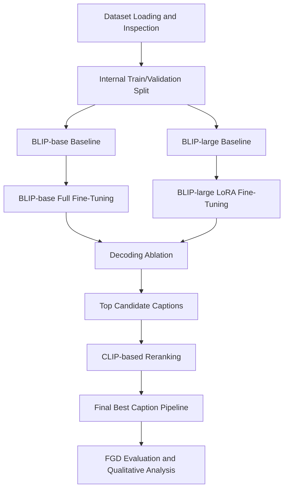
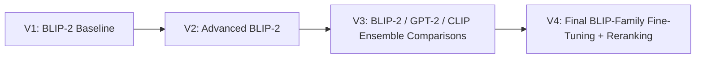
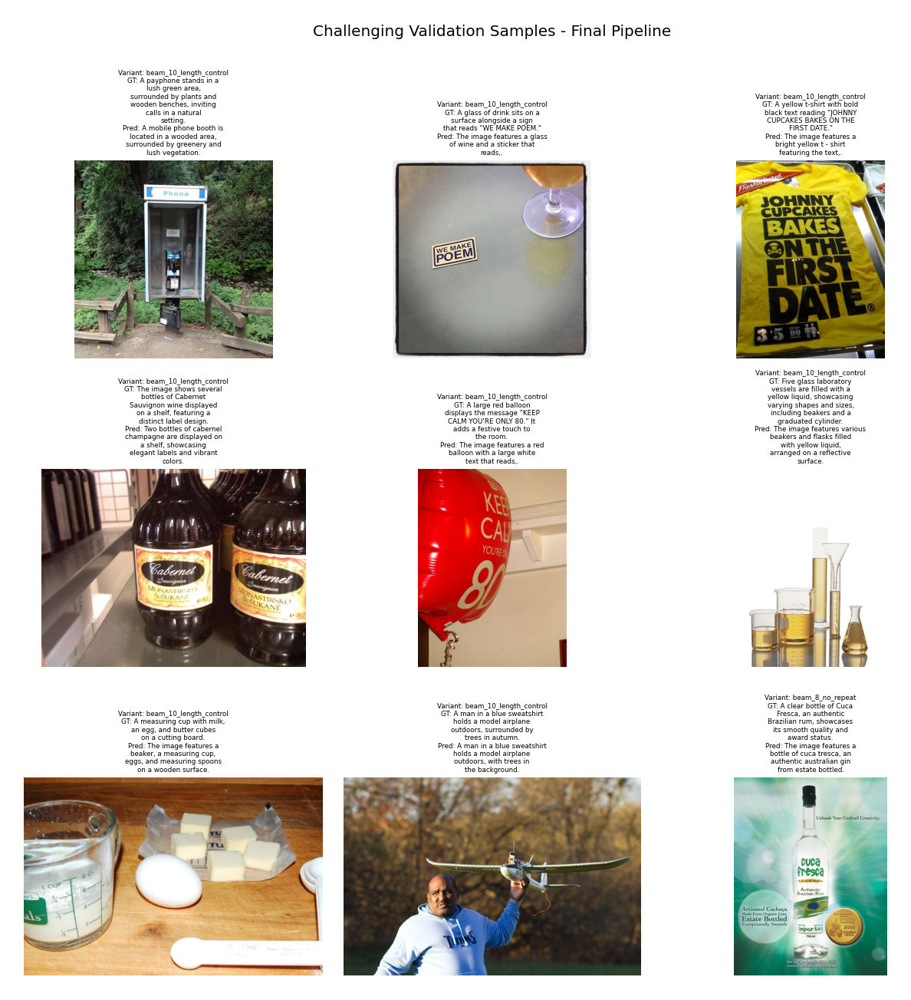
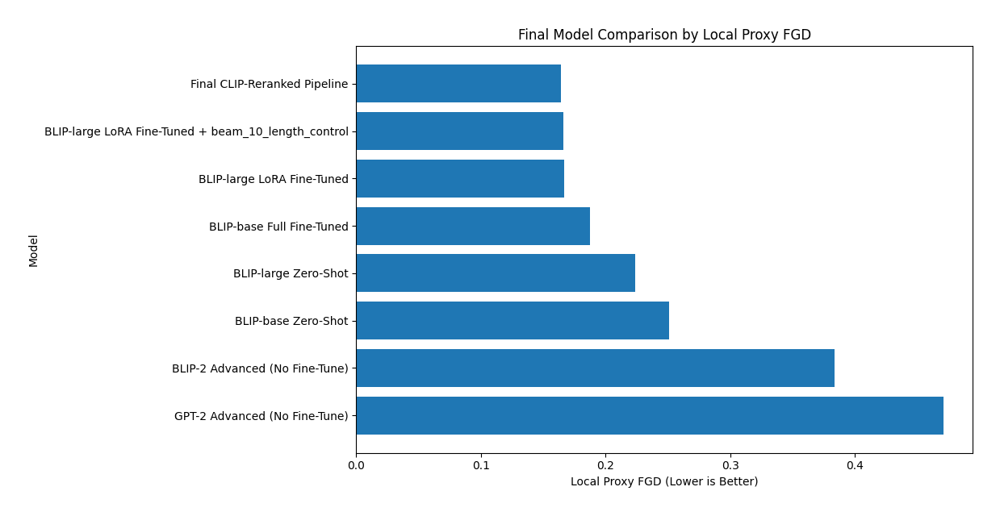

# Image Captioning: BLIP-Family Fine-Tuning, Decoding, and CLIP Reranking

This repository presents an **image captioning benchmark and improvement study** built around the **BLIP family**.  
The project starts from earlier BLIP-2 / GPT-2 experiments, then converges to a stronger final pipeline based on:

- **BLIP-base baseline evaluation**
- **BLIP-large baseline evaluation**
- **BLIP-base full fine-tuning**
- **BLIP-large LoRA fine-tuning**
- **decoding ablation**
- **CLIP-based reranking**

The final notebook identifies the strongest captioning pipeline in the repository and documents the full progression from baseline caption generation to a stronger reranked system.

---

## Project Motivation

Image captioning combines **Computer Vision** and **Natural Language Processing**: a model must understand the visual content of an image and generate a meaningful natural-language description.

Rather than stopping at a single pretrained baseline, this project explores a structured improvement path:

1. establish strong baselines,
2. compare model sizes,
3. test **full fine-tuning** vs **parameter-efficient adaptation**,
4. study **decoding strategy effects**,
5. and improve final outputs through **CLIP-based image-text reranking**.

This makes the repository more than a demo: it is a **small image captioning benchmark and optimization study**.

---

## Final Result

The strongest pipeline in the repository is:

> **BLIP-large LoRA Fine-Tuned + improved beam-search decoding + CLIP-based reranking**

**Best Local Proxy FGD:** **0.16428**

FGD here refers to a **local proxy Fréchet GTE Distance**, where **lower is better**.

---

## Final Pipeline Overview



---

## What Each Model Does

### BLIP / BLIP Family
**BLIP** (Bootstrapping Language-Image Pre-training) is a vision-language model family designed for tasks such as image captioning, visual question answering, and multimodal understanding.

In this repository:
- **BLIP-base** is used as the **full fine-tuning branch**
- **BLIP-large** is used as the **LoRA / PEFT branch**

### BLIP-2
**BLIP-2** is a more advanced vision-language architecture that connects pretrained vision encoders and pretrained language models through a lightweight bridging module.

In this repository, BLIP-2 is kept as a **historical baseline** from previous experiments.

### GPT-2
**GPT-2** is a text generation model. It is not a native image captioning model, but it was tested in earlier experiments as a prompt-based captioning baseline.

In this repository, GPT-2 appears as a **historical comparison point**.

### CLIP
**CLIP** (Contrastive Language-Image Pre-training) is a vision-language alignment model.

Here, CLIP is **not used to generate captions**. Instead, it is used to:
- score image-caption compatibility,
- compare candidate captions,
- and select the best-matching final caption.

---

## Methods Used

### 1. Baseline BLIP Evaluation
The project first evaluates pretrained BLIP-family models directly on the dataset to establish strong starting points.

### 2. Full Fine-Tuning
The BLIP-base branch is fully fine-tuned on the captioning task.

### 3. PEFT / LoRA
The BLIP-large branch is adapted using **LoRA**, a parameter-efficient fine-tuning technique that trains lightweight low-rank adapters instead of updating the full model.

### 4. Decoding Ablation
Multiple decoding strategies are compared to understand how inference-time generation settings affect caption quality.

### 5. CLIP-Based Reranking
Multiple candidate captions are generated and then scored with CLIP to select the most image-aligned output.

---

## Decoding Strategies Explained

The repository explicitly studies inference-time decoding rather than assuming one default generation strategy is sufficient.

### Greedy Decoding
At each step, the model chooses the single most likely next token.

**Pros**
- fast
- deterministic
- simple

**Cons**
- may become generic
- may miss better global sequences

### Beam Search
Beam search keeps multiple candidate sequences alive during generation.

**Pros**
- explores more alternatives than greedy decoding
- usually improves stability
- often produces better captions

**Cons**
- slower than greedy decoding
- can still become repetitive without constraints

### Number of Beams
The beam count controls how many candidate sequences are explored.

- lower beam count: faster, less exploration
- higher beam count: slower, more structured search

### Repetition Penalty
Discourages repeated words or phrases.

### No-Repeat N-Gram Constraint
Prevents repeated phrase patterns of a chosen length.

### Length Control
Minimum and maximum length constraints help keep captions closer to the dataset’s typical structure.

---

## Experiment Progression



---

## Main Results

### Historical Baselines
| Model | Type | Local Proxy FGD |
|---|---:|---:|
| BLIP-2 Advanced (No Fine-Tune) | Historical baseline | **0.38372** |
| GPT-2 Advanced (No Fine-Tune) | Historical baseline | **0.47089** |

### Final Notebook Results
| Model | Category | Local Proxy FGD |
|---|---:|---:|
| BLIP-base Baseline | Current notebook | **0.25076** |
| BLIP-large Baseline | Current notebook | **0.22356** |
| BLIP-base Full Fine-Tuned | Current notebook | **0.18750** |
| BLIP-large LoRA Fine-Tuned | Current notebook | **0.16674** |
| Best Decoding Variant | Current notebook | **0.16617** |
| Final CLIP-Reranked Pipeline | Current notebook | **0.16428** |

**Key takeaway:** the strongest result was achieved by combining **BLIP-large LoRA fine-tuning**, **improved beam-search decoding**, and **CLIP-based reranking**.

---

## Main Findings

- **BLIP-large outperformed BLIP-base** in baseline evaluation.
- **Task-specific adaptation mattered a lot**: both full fine-tuning and LoRA substantially improved over baseline caption generation.
- **BLIP-large + LoRA outperformed BLIP-base full fine-tuning** in this benchmark.
- **Decoding choices still mattered after training**; the best decoding setup further improved the result.
- **CLIP-based reranking produced the best final score** in the repository.

---

## Qualitative Outputs

### Example Output


### Final Comparison Figure


---

## Repository Structure

```text
├── deprecated/
│   ├── image_captioning_Combining_NLP_with_CV_v1.ipynb
│   ├── image_captioning_Combining_NLP_with_CV_v2.ipynb
│   ├── image_captioning_Combining_NLP_with_CV_v3.ipynb
│   ├── image_captioning_combining_nlp_with_cv_v6.ipynb
│   ├── image_captioning_combining_nlp_with_cv_v7.ipynb
│   ├── image_captioning_combining_nlp_with_cv_v8.ipynb
│   └── image_captioning_combining_nlp_with_cv_v9.ipynb
├── .gitignore
├── Image_Captioning_Notebook_v1_BLIP2_Baseline.ipynb
├── Image_Captioning_Notebook_v2_Advanced_BLIP2.ipynb
├── Image_Captioning_Notebook_v3_BLIP2_GPT2_CLIP_Ensemble.ipynb
├── Image_Captioning_Notebook_v4_Final_BLIP_Family_FineTuning_Reranking.ipynb
├── LICENSE
├── README.md
├── output_1.png
└── Final_Model_Comparison_by_FGD.png
```

---

## Notebook Guide

### `Image_Captioning_Notebook_v1_BLIP2_Baseline.ipynb`
Initial BLIP-2 baseline notebook.

### `Image_Captioning_Notebook_v2_Advanced_BLIP2.ipynb`
Advanced BLIP-2 inference notebook with stronger decoding.

### `Image_Captioning_Notebook_v3_BLIP2_GPT2_CLIP_Ensemble.ipynb`
Comparison notebook for BLIP-2, GPT-2, and CLIP-assisted selection.

### `Image_Captioning_Notebook_v4_Final_BLIP_Family_FineTuning_Reranking.ipynb`
Final and most important notebook in the repository.

It includes:
- dataset inspection
- internal train/validation split
- historical baseline comparison
- BLIP-base and BLIP-large baseline evaluation
- BLIP-base full fine-tuning
- BLIP-large LoRA fine-tuning
- decoding ablation
- CLIP reranking
- final comparison tables and visualizations

### `deprecated/`
Contains older and intermediate experiments kept for documentation purposes.

---

## Why This Repository Matters

This repository goes beyond a simple image captioning demo. It includes:

- baseline construction
- structured model comparison
- full fine-tuning
- parameter-efficient adaptation
- decoding ablation
- CLIP-based reranking
- quantitative comparison
- qualitative analysis

In that sense, it serves as both:
- a practical image captioning project,
- and a compact model-development study.

---

## Final Conclusion

The project shows that the best results did not come from model size alone. The strongest improvement emerged from combining:

- a strong BLIP-family captioning backbone,
- an effective adaptation strategy,
- improved decoding,
- and CLIP-based image-text-aware reranking.

The final best pipeline in this repository is:

> **BLIP-large LoRA Fine-Tuned + improved beam-search decoding + CLIP-based reranking**

with a best local proxy FGD of:

> **0.16428**

---

## License

This project is released under the terms of the repository `LICENSE` file.
